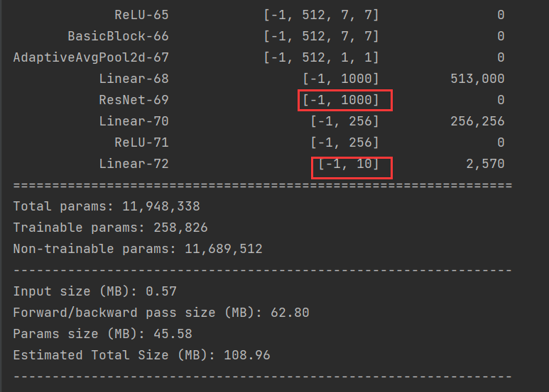
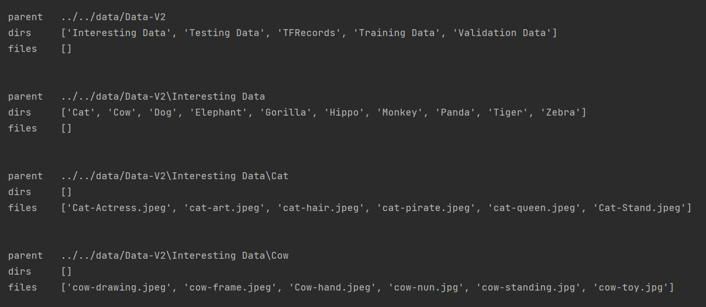
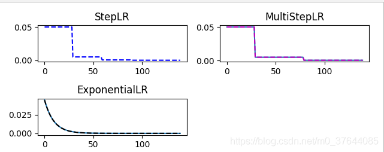

[TOC]


## 动物识别系统使用说明

### 文件目录

- 动物识别项目
  - configs
    - config.yaml配置文件
  - demo：用训练好的模型去测试自己的图片
    - input：随意放入动物图片
    - output：输出result.csv，分类结果
  - experiments：运行过程中用的代码
    - check_error.py：数据集可能错误，检查&剔除打不开的图片文件
    - dataloader.py：加载数据集，返回dataloader
    - test.py：测试模型（对demo文件夹进行操作）
    - train.py：训练模型
  - models：神经网络模型
    - resnet.py：一个基于resnet的fine-tuning的网络，输出10个种类判别
  - **demo.py**：对demo文件夹操作，加载训练好的model_static_dict.pth模型，并进行图片分类测试
  - model_static_dict.pth：保存下来的训练好的模型。已经在服务器上对模型训练了50个epoch，精度达到98.9%
  - **run.py**：用于训练网络
  - logs：日志文件，可以看到之前的训练过程记录
  - data（数据集存放文件夹，自己建立）
    - Data-V2（数据集，解压后得到，下载地址：[Animals - V2 | Image Classification Dataset | | Kaggle](https://www.kaggle.com/datasets/utkarshsaxenadn/animal-image-classification-dataset?resource=download-directory&select=Animal-Data-V2)
      - Interesting Data
      - Testing Data
      - TFRecords
      - Training Data
      - Validation Data

### 使用方法：

1. 根据需要调整config.yaml
2. 如果想自己训练模型，运行run.py；如果想直接用我训练好的，跳过这一步
3. 在demo文件夹的input中放入测试图片（已经从原数据集提供的testdata中每类动物挑选4张图片放入）
4. 运行demo.py
5. 查看demo文件夹中的output中的输出文件，可以看到测试图片文件对应的分类结果

*注意：数据集选择Data-V2版本*

## 代码解析 

### run.py

在run.py文件中，重点负责：

- 导包

  ```python
  import argparse
  import torch
  import experiments
  from experiments import *
  import models.resnet
  import yaml
  import logging
  import os
  ```

- 读取控制台参数得到yaml配置文件的地址args.filename

  ```python
  parser = argparse.ArgumentParser()
  parser.add_argument('--config', '-c',
                      dest="filename",
                      help="path to the config file",
                      default="configs/config.yaml")
  #控制台通过 python run.py --config "configs/config.yaml"来指定配置文件地址，或不加参数来使用default地址。dest为别名，后续使用args.filename即可调出文件地址。
  args = parser.parse_args()
  ```

- yaml    负责管理加载配置文件configfile

  ```python
  with open(args.filename, 'r') as file:
      configfile = yaml.safe_load(file)
  print(configfile)#字典嵌套格式。
  ```

  

- model    负责根据配置文件configfile['model_params']内容，调用建模py文件构建模型

  ```python
  model = models.resnet.Resnet(**configfile['model_params'])
  #**加“字典”{'a':1,'b':2}，会在实参传参时改为(a=1,b=2)，为防止配置文件中配置项参数数目大于Resnet类形参个数，应有Resnet.__init__(self,...,**kwargs)的kwargs来存储多出来的传参。
  ```

- logger   打日志

  

  

  ```python
  logger = logging.getLogger()# 创建logger对象
  logger.setLevel(logging.INFO)  # 设置打印级别，可以在logger处设置，也可以在handler层级设置。级别：DEBUG<INFO<WARNING<ERROR<CRITICAL
  
  formatter = logging.Formatter('%(asctime)s %(levelname)s %(message)s')#创建格式对象，后续传参给Handler
  
  sh = logging.StreamHandler()#创建Handler，负责输出log到控制台
  sh.setFormatter(formatter)#把Formatter对象设给Handler对象
  logger.addHandler(sh)#把Handler对象设给Logger对象
  
  if configfile['log']['new_log'] == True and os.path.isfile(configfile['log']['log_dir']):
      os.remove(configfile['log']['log_dir'])#追加log文件或者重新写入一个
  
  fh = logging.FileHandler(configfile['log']['log_dir'], encoding='utf8')#创建第二个Handler，负责输出log到文件
  fh.setFormatter(formatter)#同上，设置一样的Formatter格式给Handler对象
  logger.addHandler(fh)#把Handler对象设给Logger对象
  
  """
  在需要打日志的地方调用：logger.info("自定义内容")即可，如果想设置更高或更低级别，就logger.debug("...")或logger.warning("...")。注意，logger只会记录比setLevel等级更高的日志信息。
  """
  ```

- 加载数据

  ```python
  myData = dataloader.MyDataset(**configfile['data_params'])#用配置文件指导数据的加载，在类对象初始化时，__init__(self)函数将保存配置信息
  train_dataloader = myData.train_dataloader()#加载训练数据迭代器
  valid_dataloader = myData.valid_dataloader()#加载验证数据迭代器
  ```

- 训练网络

  ```python
  trainer = train.Train(**configfile['train_params'])
  trainer.train(model, train_dataloader, valid_dataloader, logger)
  ```

- 保存网络

  ```python
  torch.save(model.state_dict(),"model_static_dict.pth")
  ```

### models/resnet.py：

- 导包

  ```python
  from torch import nn
  import torchvision
  from torchsummary import summary
  ```

- 定义网络，fine-tune一个torchvision.models.resnet，模型输出维度为类型个数，预训练模型参数梯度

### experiments/check_error.py

通过遍历数据集来检测并删除错误的数据（有可能看起来是正常的图片，但是读到网络里就会有异常抛出）

- 导包

  ```python
  import os
  import warnings
  from PIL import Image
  ```

- 思想：os.walk遍历整个数据集，如果打开图片错误，就记录他并返回

  os.walk 的返回值是一个生成器(generator)

  --root 指的是当前正在遍历的这个文件夹的本身的地址

  --dirs 返回的是一个列表list，是该文件夹中所有的目录的名称(但不包括子目录名称) 

  --files 返回的也是一个列表list , 是该文件夹中所有的文件名称(但不包括子目录名称)

  forloop循环会树状逐个遍历文件夹，最终扫过全部的图片，并将每张图片都送入is_read_successfully()

  ```python
      def check(self):
          errorImgs=[]
          for parent, dirs, files in os.walk(self.base_dir):#(root,dirs,files)
              for file in files:
                  if not self.is_read_successfully(os.path.join(parent, file)):
                      errorImgs.append(os.path.join(parent, file))
                      print(os.path.join(parent, file))
          return errorImgs
      def is_read_successfully(self,file):
          try:
              imgFile = Image.open(file)  # 这个就是一个简单的打开成功与否
              return True
          except Exception:
              return False    
  ```

  

- 删除错误图片

  ```python
      def doDelete(self):
          errorImgs=self.check()
          for i in errorImgs:
              os.remove(i) #真正使用时，这一行要放开，自己一般习惯先跑一遍，没有错误了再删除，防止删错。
  ```

### experiments/dataloader.py

1. 初始化类，形参*args和**kwargs会接受多余的参数。并且检查图片文件。

   ```python
       def __init__(self,data_dir,train_batch_size,val_batch_size,num_workers,if_check,*args,**kwargs):
           self.data_dir=data_dir
           self.train_batch_size=train_batch_size
           self.val_batch_size=val_batch_size
           self.test_batch_size=val_batch_size
           self.num_workers=num_workers
           if if_check:
               print("checking all images")
               checker=checkErrorImgs(os.path.join(self.data_dir, "Training Data"))
               checker.doDelete()
               checker = checkErrorImgs(os.path.join(self.data_dir, "Validation Data"))
               checker.doDelete()
               checker = checkErrorImgs(os.path.join(self.data_dir, "Testing Data"))
               checker.doDelete()
           else:
               print("skip the check of all images")
   ```

   

2. 仅用加载train数据的函数作为例子。由于DataV2数据集符合ImageFolder规定的数据集的组织结构

- *root*/dog/xxx.png

- *root*/dog/xxy.png

- *root*/dog/xxz.png

  所以可以如下加载数据集。并且对图片做了一系列的增广操作，来扩充数据集。

```python
def train_dataloader(self):
    path = os.path.join(self.data_dir, "Training Data")
    transform = torchvision.transforms.Compose([torchvision.transforms.Resize(256),
                                                torchvision.transforms.CenterCrop(224),
                                                torchvision.transforms.RandomHorizontalFlip(),
                                                torchvision.transforms.ColorJitter(brightness=0.2, contrast=0.2,
                                                                                   saturation=0.2),
                                                torchvision.transforms.ToTensor(),
                                                torchvision.transforms.Normalize([0.485, 0.456, 0.406],
                                                                                 [0.229, 0.224, 0.225])])
    dataset=torchvision.datasets.ImageFolder(root=path,transform=transform)
    dataloader = data.DataLoader(dataset=dataset, batch_size=self.train_batch_size, shuffle=True,
                                      num_workers=self.num_workers)
    return dataloader
```

### experiments/train.py

1. 导包

   ```python
   import torch
   from torch import  nn
   from draw import drawPlot
   import time
   ```

2. 初始化训练器的参数

   ```python
       def __init__(self,**kwargs):
           self.lr=kwargs['lr']#学习率
           self.wd=kwargs['weight_decay']#权重衰减——定义正则项的系数
           self.gamma=kwargs['scheduler_gamma']#lr会随着训练epoch的迭代而变小。scheduler可以管理lr的衰减。gamma为衰减率。
           self.gpus=[torch.device("cuda",i) for i in kwargs['gpus']]#'gpus':[0]
           self.epochs=kwargs['epochs']#epoch的个数
   ```

3. 定义准确率函数，用于展示运行中模型的准确率来打log。返回正确判别的个数。

   $y: Tensor(bs,numClasses); y_{hat}: Tensor(bs)$

   ```python
       def model_acc(self,y,y_hat):
           return (y_hat.argmax(axis=1)==y).float().sum()
   ```

4. 评估模型，用于在训练一整个epoch后，利用valid数据集进行评估模型效果。更新valid_acc中的数据。

   ```python
       def evaluate(self,net,valid_dataloader,valid_acc,device):
           with torch.no_grad():#取消梯度计算
               for X,y in valid_dataloader:
                   X=X.to(device)
                   y=y.to(device)
                   y_hat=net(X)
                   valid_acc[0]+=self.model_acc(y,y_hat)#batch中判别正确的个数
                   valid_acc[1]+=y.numel()#batch中的数据个数
               return valid_acc
   ```

5. 定义训练函数

   **L2 Penalty权重衰减（所谓权重衰减，就是对参数中的weight值的取值范围进行过大惩罚机制）：**$Loss=CrossEntropyLoss+\frac{self.wd}{2}\cdot \Sigma \;[net.parameters()^2]$ .在pytorch的optim优化器中，可以传入权重衰减的权重，配置文件里给到了0.00001，可见，虽然进行权重衰减，但是不宜太过。在SGD中，会把参数$net.parameters()$传进来，所以在这一步做权重衰减很好。背后底层代码将反向传播权重penalty部分的梯度并叠加到$net.parameters().data.grad$上。随后做随机梯度下降$net.parameters()=net.parameters()-lr\cdot gradient$即可。

   **lr_scheduler对lr进行运行时调整：**每个epoch进行：$lr=lr\cdot gamma$ 配置文件中,gamma=0.95

   **请仔细阅读训练函数，一般都是模板定式**

   

   ```python
       def train(self,net,train_dataloader,valid_dataloader,logger):
           loss=nn.CrossEntropyLoss(reduction='none')#交叉熵损失，返回loss:Tensor(bs)，没有求mean。
           optim=torch.optim.SGD(net.parameters(),lr=self.lr,weight_decay=self.wd)#优化器：net.parameters()=net.parameters()-lr*gradient
           scheduler=torch.optim.lr_scheduler.ExponentialLR(optim,gamma=self.gamma)#对lr进行运行时调整
           device=self.gpus[0]
           net=net.to(device)
           train_acc_list=[]#为了最终画图用，所以要存下变化情况
           train_loss_list=[]
           valid_acc_list=[]
           for epoch in range(self.epochs):
               net.train()#注意此语句位置
               train_acc=[0.0]*2
               train_loss=[0.0]*2
               valid_acc=[0.0]*2
               total_time=0
               for X,y in train_dataloader:
                   start_time=time.time()
                   X=X.to(device)
                   y=y.to(device)
                   y_hat=net(X)
                   l=loss(y_hat,y).sum()
                   optim.zero_grad()
                   l.backward()
                   optim.step()
                   with torch.no_grad():
                       train_acc[0]+=self.model_acc(y,y_hat)
                       train_acc[1]+=y.numel()
                       train_loss[0]+=l
                       train_loss[1]+=y.numel()
                   total_time += time.time()-start_time
   
               net.eval()
               valid_acc=self.evaluate(net,valid_dataloader,valid_acc,device)
               logger.info(f"epoch{epoch}:train_loss:{train_loss[0]/train_loss[1]:.4f},"
                     f"train_acc:{train_acc[0]}/{train_acc[1]}={train_acc[0]/train_acc[1]:.4f},valid_acc:{valid_acc[0]}/{valid_acc[1]}={valid_acc[0]/valid_acc[1]:.4f},speed={train_loss[1]/total_time:.1f}items/sec")
               train_loss_list.append(train_loss[0]/train_loss[1])
               train_acc_list.append(train_acc[0]/train_acc[1])
               valid_acc_list.append(valid_acc[0]/valid_acc[1])
               scheduler.step()
           drawPlot(train_loss_list,self.epochs,"epochs","train_loss","训练集上损失的迭代变化")
           drawPlot(train_acc_list,self.epochs,"epochs","train_acc","训练集上精度的迭代变化")
           drawPlot(valid_acc_list,self.epochs,"epochs","valid_acc","测试集上精度的迭代变化")
   
   ```

### experiments/draw.py：

```python
from matplotlib import pyplot as plt
from matplotlib.font_manager import FontProperties
font_set=FontProperties(fname=r"c:\windows\fonts\simsun.ttc", size=15)#定义字体和大小，返回保存这个设置的一个“设置对象”
def drawPlot(list,epoch,xlabel,ylabel,title):
    plt.figure()
    x1=range(1,epoch+1)
    y1=list
    plt.cla()#plt.cla() 表示清除当前轴
    plt.title(title, fontproperties=font_set)
    plt.plot(x1,y1,'.-')
    plt.xlabel(xlabel)
    plt.ylabel(ylabel)
    plt.grid()
    plt.savefig(f"./{ylabel}-{xlabel}.png")
    plt.show()
```

### demo.py

加载已经训练好的模型参数，并调用test来测试图片分类结果。随机给照片，让其分类,把照片放入demo/input中，我们从demo/output/result.csv中输出对应照片的分类结果

```python
model=resnet.Resnet(**configfile['model_params'])
model.load_state_dict(torch.load('model_static_dict.pth'))
test.test(model,**configfile['test_params'])
```

### experiments/test.py

1. 把图片名称读入images[]

   ```python
   def test(net,input_dir,output_dir,categories):
       net.eval()
       images = []
       for item in os.listdir(input_dir):
           images.append(item)
       print(images)    
   ```

2. 读取图片并经过transform

   ```python
       transform = torchvision.transforms.Compose([torchvision.transforms.Resize(256),
                                                   torchvision.transforms.CenterCrop(224),
                                                   torchvision.transforms.ToTensor(),
                                                   torchvision.transforms.Normalize([0.485, 0.456, 0.406],
                                                                                    [0.229, 0.224, 0.225])
                                                   ])
       features=[transform( Image.open(os.path.join(input_dir,i)) ) for i in images]
   ```

3. 图片依次经过net得到分类结果，并依次存入labels：["cat","cat","dog"...]

   ```python
       labels=[]
       for i in features:
           idx=int(net(i.unsqueeze(0)).argmax(axis=1))
           labels.append(categories[idx])
   ```

4. 一行一行['filename','category']依次写入csv文件

   ```python
       with open(os.path.join(output_dir,"result.csv"),'w') as f:
           csv_writter=csv.writer(f)
           csv_head=['filename','category']
           csv_writter.writerow(csv_head)
           for i in range(len(labels)):
               csv_writter.writerow([images[i],labels[i]])
   ```

