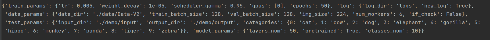
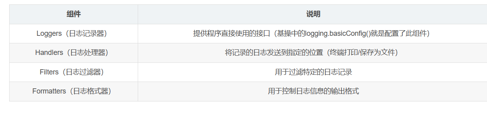
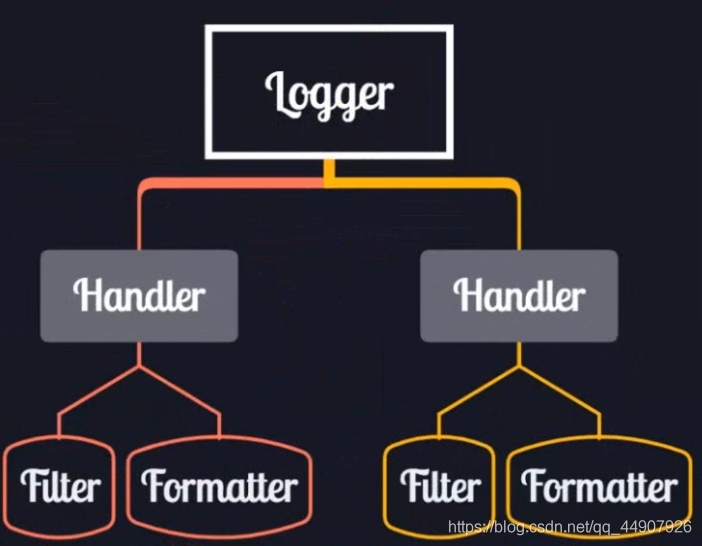

[TOC]


## 动物识别系统使用说明

### 文件目录

- 动物识别项目
  - configs
    - config.yaml配置文件
  - demo：用训练好的模型去测试自己的图片
    - input：随意放入动物图片
    - output：输出result.csv，分类结果
  - experiments：运行过程中用的代码
    - check_error.py：数据集可能错误，检查&剔除打不开的图片文件
    - dataloader.py：加载数据集，返回dataloader
    - test.py：测试模型（对demo文件夹进行操作）
    - train.py：训练模型
  - models：神经网络模型
    - resnet.py：一个基于resnet的fine-tuning的网络，输出10个种类判别
  - demo.py：对demo文件夹操作，加载训练好的model_static_dict.pth模型，并进行图片分类测试
  - model_static_dict.pth：保存下来的训练好的模型。已经在服务器上对模型训练了50个epoch，精度达到98.9%
  - run.py：用于训练网络
  - logs：日志文件，可以看到之前的训练过程记录
  - data（数据集存放文件夹，自己建立）
    - Data-V2（数据集，解压后得到，下载地址：[Animals - V2 | Image Classification Dataset | | Kaggle](https://www.kaggle.com/datasets/utkarshsaxenadn/animal-image-classification-dataset?resource=download-directory&select=Animal-Data-V2)
      - Interesting Data
      - Testing Data
      - TFRecords
      - Training Data
      - Validation Data

### 使用方法：

1. 根据需要调整config.yaml
2. 如果想自己训练模型，运行run.py；如果想直接用我训练好的，跳过这一步
3. 在demo文件夹的input中放入测试图片（已经从原数据集提供的testdata中每类动物挑选4张图片放入）
4. 运行demo.py
5. 查看demo文件夹中的output中的输出文件，可以看到测试图片文件对应的分类结果

*注意：数据集选择Data-V2版本*

## 代码解析

**run.py**

在run.py文件中，重点负责：

- 导包

  ```python
  import argparse
  import torch
  import experiments
  from experiments import *
  import models.resnet
  import yaml
  import logging
  import os
  ```

- 读取控制台参数得到yaml配置文件的地址args.filename

  ```python
  parser = argparse.ArgumentParser()
  parser.add_argument('--config', '-c',
                      dest="filename",
                      help="path to the config file",
                      default="configs/config.yaml")
  #控制台通过 python run.py --config "configs/config.yaml"来指定配置文件地址，或不加参数来使用default地址。dest为别名，后续使用args.filename即可调出文件地址。
  args = parser.parse_args()
  ```

- yaml    负责管理加载配置文件configfile

  ```python
  with open(args.filename, 'r') as file:
      configfile = yaml.safe_load(file)
  print(configfile)#字典嵌套格式。
  ```

  

- model    负责根据配置文件configfile['model_params']内容，调用建模py文件构建模型

  ```python
  model = models.resnet.Resnet(**configfile['model_params'])
  #**加“字典”{'a':1,'b':2}，会在实参传参时改为(a=1,b=2)，为防止配置文件中配置项参数数目大于Resnet类形参个数，应有Resnet.__init__(self,...,**kwargs)的kwargs来存储多出来的传参。
  ```

- logger   打日志

  

  

  ```python
  logger = logging.getLogger()#创建logger对象
  logger.setLevel(logging.INFO)  # 设置打印级别，可以在logger处设置，也可以在handler层级设置。级别：DEBUG<INFO<WARNING<ERROR<CRITICAL
  
  formatter = logging.Formatter('%(asctime)s %(levelname)s %(message)s')#创建格式对象，后续传参给Handler
  
  sh = logging.StreamHandler()#创建Handler，负责输出log到控制台
  sh.setFormatter(formatter)#把Formatter对象设给Handler对象
  logger.addHandler(sh)#把Handler对象设给Logger对象
  
  if configfile['log']['new_log'] == True and os.path.isfile(configfile['log']['log_dir']):
      os.remove(configfile['log']['log_dir'])#追加log文件或者重新写入一个
  
  fh = logging.FileHandler(configfile['log']['log_dir'], encoding='utf8')#创建第二个Handler，负责输出log到文件
  fh.setFormatter(formatter)#同上，设置一样的Formatter格式给Handler对象
  logger.addHandler(fh)#把Handler对象设给Logger对象
  
  """
  在需要打日志的地方调用：logger.info("自定义内容")即可，如果想设置更高或更低级别，就logger.debug("...")或logger.warning("...")。注意，logger只会记录比setLevel等级更高的日志信息。
  """
  ```

- 加载数据

  ```python
  myData = dataloader.MyDataset(**configfile['data_params'])#用配置文件指导数据的加载，在类对象初始化时，__init__(self)函数将保存配置信息
  train_dataloader = myData.train_dataloader()#加载训练数据迭代器
  valid_dataloader = myData.valid_dataloader()#加载验证数据迭代器
  ```

- 训练网络

  ```python
  trainer = train.Train(**configfile['train_params'])
  trainer.train(model, train_dataloader, valid_dataloader, logger)
  ```

- 保存网络

  ```python
  torch.save(model.state_dict(),"model_static_dict.pth")
  ```

  
